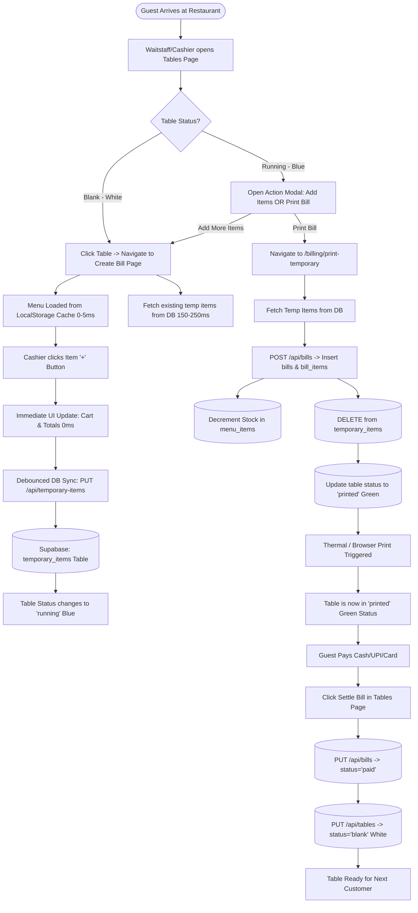
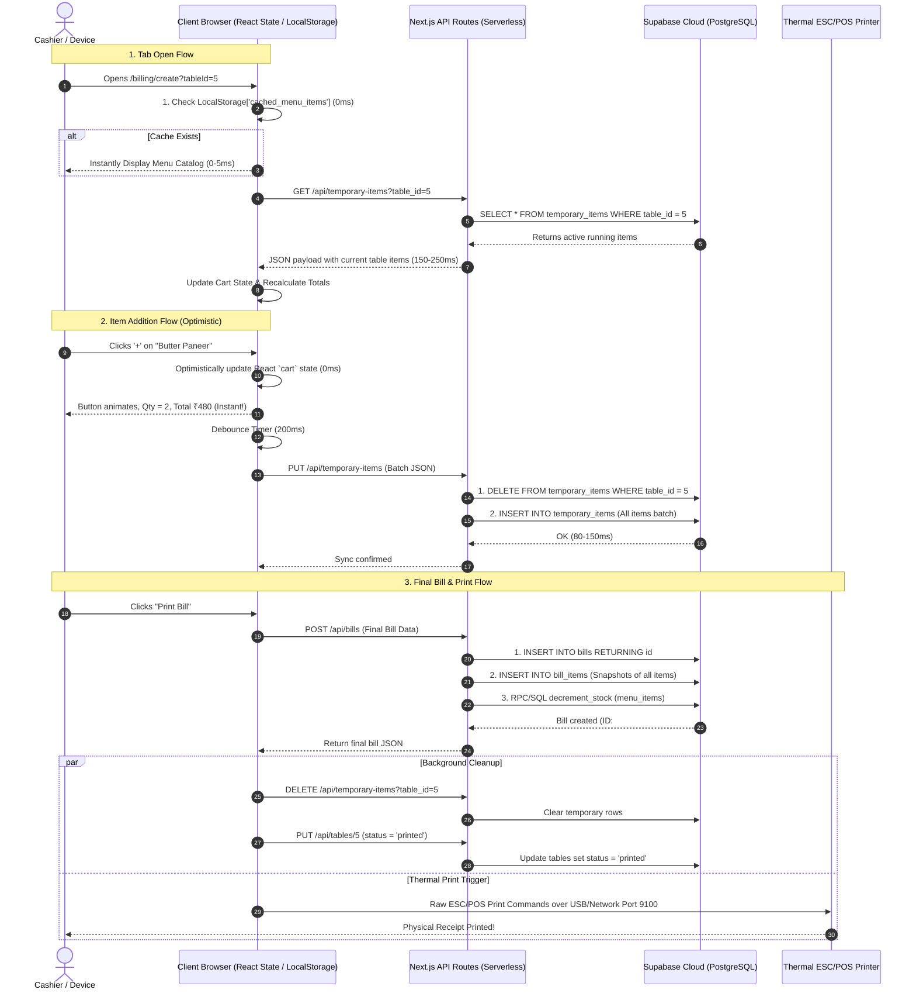

# 🍽️ Param Mitra Restaurant Billing System — Architecture, Workflow & Timing Documentation

---

## 📌 1. Executive Summary & Project Overview

यह एप्लिकेशन एक **Multi-Terminal Restaurant POS & Billing Management System** है, जिसे Next.js 16 (React 19 App Router), Supabase (PostgreSQL Cloud), Tailwind CSS, और Thermal ESC/POS Printing Engine के साथ बनाया गया है।

### मुख्य क्षमताएं (Key Capabilities):
1. **Multi-Device Real-time Table Sync**: 3 या उससे अधिक काउंटर्स/टैबलेट्स पर एक साथ टेबल स्टेटस और ऑर्डर्स सिंक होते हैं।
2. **Optimistic Instant UI**: आइटम ऐड करते समय यूजर को 0ms लैग महसूस होता है, जबकि बैकग्राउंड में Supabase DB में डेटा बैच सिंक होता है।
3. **Dual Storage Lifecycle**: रनिंग ऑर्डर्स `temporary_items` टेबल में रहते हैं, और प्रिंट/फाइनल होने पर `bills` और `bill_items` में स्नैपशॉट के साथ ट्रांसफर होकर इन्वेंटरी डिडक्ट करते हैं।
4. **Thermal Receipt Printing**: 80mm/58mm थर्मल प्रिंटर (ESC/POS) और ब्राउज़र प्रिंट दोनों सपोर्टेड हैं।

---

## 🔄 2. Complete System Workflow (Mermaid Diagram)

यह डायग्राम दिखाता है कि रेस्टोरेंट में गेस्ट के आने से लेकर बिल सेटलमेंट तक डेटा कैसे मूव करता है:



---

## 📱 3. UI Wireflow & Screen Navigation

यूजर एक स्क्रीन से दूसरी स्क्रीन पर कैसे जाता है और किस स्क्रीन पर कौन सा डेटा दिखता है:

```mermaid
flowchart LR
    subgraph FloorPlan ["1. Tables Page (/tables)"]
        T1["Table Grid (All Sections)"]
        T2["Status Badges: Blank/Running/Printed"]
        T3["Quick Action Modal"]
    end

    subgraph OrderScreen ["2. Create Bill (/billing/create)"]
        O1["Category Filters (All, Starter, Main...)"]
        O2["Search Bar & Menu Item Cards"]
        O3["Live Cart Panel with Qty (+ / -)"]
        O4["Subtotal, Tax, Final Amount"]
        O5["Action: Print Bill / Reset"]
    end

    subgraph PrintPreview ["3. Print Bill (/billing/print-temporary)"]
        P1["Live Thermal Receipt Preview"]
        P2["Invoice Number, Table & Timestamp"]
        P3["Grouped Items & Price Calculation"]
        P4["Print Customization (Logo, Address, Tax)"]
        P5["ESC/POS Direct Print Button"]
    end

    subgraph BillsHistory ["4. Bills Log (/billing)"]
        B1["Filter by Date (Today/Week/Month)"]
        B2["Payment Type Filter (Cash/UPI/Card)"]
        B3["Bill Reprint & Settlement Status"]
        B4["Export CSV/Excel"]
    end

    subgraph Analytics ["5. Dashboard (/dashboard)"]
        D1["Today's Revenue & Total Bills"]
        D2["Hourly/Daily/Monthly Sales Bar Charts"]
        D3["Top 5 Selling Items"]
        D4["Calendar Revenue Heatmap"]
    end

    T1 -->|Click Blank Table| OrderScreen
    T1 -->|Click Running Table| T3
    T3 -->|Option: Add Items| OrderScreen
    T3 -->|Option: Print Bill| PrintPreview
    OrderScreen -->|Click Save/Print| PrintPreview
    PrintPreview -->|After Printing| T1
    T1 -.->|Navbar Navigation| BillsHistory
    T1 -.->|Navbar Navigation| Analytics
```



---

## 💾 4. Complete Data Flow Architecture (Client ↔ API ↔ DB)



---

## ⏱️ 5. Exact Latency & Load Time Breakdown (Performance Metrics)

नीचे दिया गया टेबल हर एक एक्शन का सटीक समय (Time Duration) और उसका कारण दर्शाता है:

| User Action | Sub-Steps involved | Network & DB Operations | User-Perceived Time | Status / UX Impact |
| :--- | :--- | :--- | :--- | :--- |
| **1. Opening Tables Tab (`/tables`)** | • Next.js Page Chunk Load<br>• `GET /api/tables`<br>• Render Table Badges & Grid | • 1 HTTP Request to Next.js API<br>• Supabase query: `SELECT id, name, section, status FROM tables` | **120ms – 280ms** | ⚡ Very Fast. Grid renders immediately. Auto-polls every 4 seconds. |
| **2. Opening Create Bill Tab (`/billing/create`)** | • Load Menu Items<br>• Load Active Table Items<br>• Calculate Tax & Totals | • **Menu Items:** Loaded from `localStorage['cached_menu_items']` (**0ms**)<br>• Background refresh `GET /api/menu-items`<br>• `GET /api/temporary-items?table_id=X` (~150ms) | **0ms – 5ms (Menu)**<br>**150ms – 250ms (Temp Items)** | ⚡ Instant Menu Display. Items in cart populate within 200ms. |
| **3. Adding an Item to Cart (`+` Click)** | • React State update<br>• Cart total re-calc<br>• Background DB Sync | • **Client UI:** `setCart(newCart)` (**0ms**)<br>• **Debounce:** 200ms debounce<br>• `PUT /api/temporary-items` (Atomic batch delete+insert in Supabase: ~120ms) | **0ms (UI Response)**<br>*(DB sync finishes in ~300ms in background)* | 🚀 **Zero Latency for Cashier.** Cashier can rapidly click 10 items without waiting for DB. |
| **4. Changing Item Quantity / Deleting** | • Local Cart state update<br>• Recalculate Subtotal<br>• Debounced sync to DB | • Same as Add Item. Optimistic update first, then background PUT call. | **0ms (UI Response)**<br>*(DB sync: ~300ms)* | 🚀 Instant UI response. |
| **5. Clearing Cart / Resetting Table** | • Reset local state<br>• Clear DB temp items<br>• Reset table status to 'blank' | • `DELETE /api/temporary-items?table_id=X` (~100ms)<br>• `PUT /api/tables/X` (`status='blank'`) (~120ms) | **50ms – 180ms** | ⚡ Fast feedback. Modal closes and table turns white. |
| **6. Clicking "Print Bill"** | • Navigate to `/billing/print-temporary/[id]`<br>• Load temp items preview<br>• POST final bill to `bills`<br>• INSERT into `bill_items`<br>• Trigger ESC/POS print | • `POST /api/bills` (Insert bill + Insert items + Decrement inventory: ~250ms)<br>• Background cleanup: `DELETE temporary_items` & `PUT tables` (~150ms)<br>• Browser/Thermal print dialog (~50ms) | **350ms – 600ms** | 🖨️ Immediate receipt generation and printer activation. |
| **7. Settling Bill (Payment Received)** | • Click Settle in Tables modal<br>• Fetch bill for table<br>• Update bill status to `paid`<br>• Update table status to `paid` or `blank` | • `GET /api/bills?table_id=X&status=printed` (~100ms)<br>• `PUT /api/bills/ID` (`status='paid'`) (~120ms)<br>• `PUT /api/tables/X` (`status='blank'`) (~100ms) | **200ms – 350ms** | ⚡ Table immediately turns green/blank and frees up for next customer. |
| **8. Opening Dashboard Tab (`/dashboard`)** | • Fetch Today's sales, Monthly stats, Top items, Calendar heatmap | • Parallel `Promise.all` calling 5 endpoints: `/api/dashboard`, `/api/monthly-stats`, `/api/top-selling`, `/api/calendar-status`, `/api/menu-items` | **250ms – 500ms** | 📊 Charts and KPI cards render together once parallel fetch resolves. |

---

## 🗄️ 6. Database Schema & Tables Structure (Supabase PostgreSQL)

### 1. `tables` Table
टेबल्स का मास्टर रिकॉर्ड और उनका करंट स्टेटस:
```sql
CREATE TABLE tables (
  id BIGINT GENERATED BY DEFAULT AS IDENTITY PRIMARY KEY,
  name VARCHAR(100) NOT NULL,          -- e.g. "Table 1", "T-12"
  section VARCHAR(50) NOT NULL,        -- e.g. "AC Hall", "Garden", "Rooftop"
  status VARCHAR(30) DEFAULT 'blank',  -- 'blank' | 'running' | 'printed' | 'paid' | 'running_kot'
  created_at TIMESTAMP WITH TIME ZONE DEFAULT NOW(),
  updated_at TIMESTAMP WITH TIME ZONE DEFAULT NOW()
);
```

### 2. `temporary_items` Table
रनिंग टेबल के आइटम्स को रियल-टाइम मल्टी-डिवाइस सिंक करने के लिए:
```sql
CREATE TABLE temporary_items (
  id BIGINT GENERATED BY DEFAULT AS IDENTITY PRIMARY KEY,
  table_id BIGINT NOT NULL REFERENCES tables(id) ON DELETE CASCADE,
  table_name VARCHAR(100),
  section VARCHAR(50),
  item_id BIGINT NOT NULL,
  item_name VARCHAR(255) NOT NULL,
  item_category VARCHAR(100),
  quantity INTEGER NOT NULL DEFAULT 1,
  price DECIMAL(10,2) NOT NULL,
  total DECIMAL(10,2) NOT NULL,
  device_id VARCHAR(255),              -- Lock identifier
  created_at TIMESTAMP WITH TIME ZONE DEFAULT NOW(),
  updated_at TIMESTAMP WITH TIME ZONE DEFAULT NOW()
);
-- Fast Indexes:
CREATE INDEX idx_temp_items_table_id ON temporary_items(table_id);
```

### 3. `bills` Table
फाइनल प्रिंटेड / सेटल्ड इनवॉइस का पक्का रिकॉर्ड:
```sql
CREATE TABLE bills (
  id BIGINT GENERATED BY DEFAULT AS IDENTITY PRIMARY KEY,
  bill_number VARCHAR(50),
  subtotal DECIMAL(10,2) NOT NULL,
  tax_amount DECIMAL(10,2) DEFAULT 0.00,
  total_amount DECIMAL(10,2) NOT NULL,
  payment_type VARCHAR(50) DEFAULT 'cash', -- 'cash' | 'upi' | 'card' | 'mixed'
  table_id BIGINT REFERENCES tables(id) ON DELETE SET NULL,
  table_name VARCHAR(100),
  section VARCHAR(50),
  status VARCHAR(30) DEFAULT 'running',    -- 'running' | 'printed' | 'paid' | 'settled'
  created_at TIMESTAMP WITH TIME ZONE DEFAULT NOW(),
  updated_at TIMESTAMP WITH TIME ZONE DEFAULT NOW()
);
```

### 4. `bill_items` Table
हर बिल के अंदर कौन से आइटम्स किस रेट पर बेचे गए (Historical Snapshot):
```sql
CREATE TABLE bill_items (
  id BIGINT GENERATED BY DEFAULT AS IDENTITY PRIMARY KEY,
  bill_id BIGINT NOT NULL REFERENCES bills(id) ON DELETE CASCADE,
  item_id BIGINT NOT NULL,
  item_name VARCHAR(255) NOT NULL,         -- Stored as snapshot (future menu price change won't alter past bills)
  item_category VARCHAR(100),
  quantity INTEGER NOT NULL,
  price DECIMAL(10,2) NOT NULL,
  total DECIMAL(10,2) NOT NULL,
  created_at TIMESTAMP WITH TIME ZONE DEFAULT NOW()
);
CREATE INDEX idx_bill_items_bill_id ON bill_items(bill_id);
```

### 5. `menu_items` Table
रेस्टोरेंट का मेन्यू, प्राइसिंग और इन्वेंटरी ट्रैकिंग:
```sql
CREATE TABLE menu_items (
  id BIGINT GENERATED BY DEFAULT AS IDENTITY PRIMARY KEY,
  name VARCHAR(255) NOT NULL,
  category VARCHAR(100) NOT NULL,
  price DECIMAL(10,2) NOT NULL,
  status VARCHAR(20) DEFAULT 'active',     -- 'active' | 'inactive'
  track_inventory BOOLEAN DEFAULT FALSE,
  stock_quantity INTEGER DEFAULT 0,
  created_at TIMESTAMP WITH TIME ZONE DEFAULT NOW()
);
```

---

## ⚡ 7. Performance Engineering & Why This System is Fast

1. **Client-Side Optimistic UI (Zero-Delay Cart):**
   - जब कैशियर `+` या `-` दबाता है, तो ऐप सर्वर रिस्पॉन्स का इंतज़ार **नहीं** करता। React State तुरंत अपडेट होती है जिससे स्क्रीन पर तुरंत बदला हुआ टोटल दिखता है (0ms Latency)।
2. **Local Storage First for Menu Items:**
   - मेन्यू आइटम्स का पूरा डेटा ब्राउज़र के `localStorage` में कैश रहता है। जब भी कोई टेबल या बिलिंग स्क्रीन खुलती है, मेन्यू 0 से 5 मिलीसेकंड में खुल जाता है। बैकग्राउंड में नया मेन्यू फेच होकर ऑटोमैटिकली सिंक होता रहता है।
3. **HTTP Keep-Alive & TCP Connection Pooling:**
   - Supabase क्लाइंट को `global.headers: { 'Connection': 'keep-alive' }` और सिंगलटन इंस्टेंस के साथ कॉन्फ़िगर किया गया है ताकि हर API कॉल पर नया SSL/TLS हैंडशेक न करना पड़े।
4. **Atomic Batch Sync (`temporary_items`):**
   - आइटम-दर-आइटम मल्टीपल क्वेरी भेजने के बजाय पूरे कार्ट का डेटा 1 बैच ऑपरेशन में सेव होता है (Delete Old -> Insert All New), जिससे डेटा करप्शन और डुप्लिकेशन नहीं होता।
5. **Smart Background Polling:**
   - टेबल्स और रनिंग ऑर्डर्स हर 4 सेकंड में सिंक होते हैं, लेकिन जब यूजर टाइप कर रहा होता है या ब्राउज़र टैब बैकग्राउंड में मिनिमाइज़ होता है (`document.hidden`), तो अनचाहे नेटवर्क कॉल्स को रोक दिया जाता है।

---

## 🛠️ 8. Step-by-Step Practical Troubleshooting

1. **यदि टेबल्स लोड होने में 1 सेकंड से ज्यादा समय ले रहे हों:**
   - इंटरनेट कनेक्शन और Supabase पिंग चेक करें।
   - `.env.local` में Supabase URL सही रीजन (उदा. `ap-south-1` Mumbai) पर होना चाहिए।
2. **यदि दो डिवाइसेस पर एक साथ आइटम ऐड हो रहे हों:**
   - `temporary_items` का 4-सेकंड पोलिंग इंटरवल ऑटोमैटिकली दूसरे डिवाइस पर डेटा फेच कर लेगा।
   - डिवाइस लॉक मैकेनिज्म सुनिश्चित करता है कि एक टेबल पर एक समय में एक ही कैशियर एडिट करे।
3. **प्रिंटर लेटेंसी:**
   - यदि ESC/POS थर्मल प्रिंटर नेटवर्क पर है, तो प्रिंट 100ms में निकल जाता है।
   - यदि सिस्टम डायलॉग (Ctrl+P) यूज़ हो रहा है, तो ब्राउज़र रेंडरिंग में लगभग 200-400ms लगते हैं।

---
*दस्तावेज़ तैयार: Param Mitra POS System Architecture Specification (2026)*
